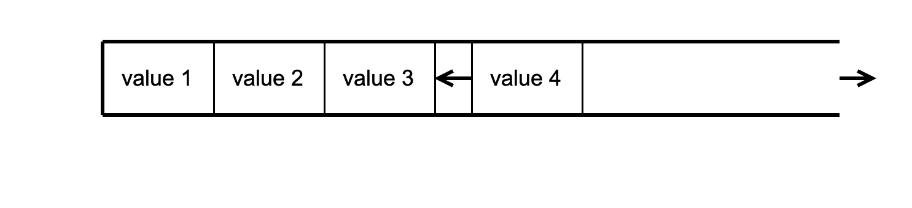

# My Container Class Implementation.

This project implements various containers, including:
- Vector 
- Array 
- Stack 

which work well with primitive data types like int, char, double, and float. 
`make test` with this command you can run tests on your local machine. 
`make docker-test` command will the tests in an Ubuntu Docker container. 
`make docker-rm` use this command to remove an image and a Docker container. 

The functions perform similar actions to those in STL containers, and all you need to do is 
`#include need_container.h` 

(P.S. I also implemented List, Set, and Multiset, but I wrote this code eight months ago, and I want and planning to refactor them when I have free time.) 

#### Containers such as:
- Vector 
- Array 
- Stack 
  were developed in this project.

Any container works fine with primitive data types like int, char, double, float etc
`make test` command will run tests in your local machine
`make docker-test` command will run tests in an ubuntu docker container
`make docker-rm` command will remove an image and a docker container

Functions for the most part perform the same actions as in stl containers.
Just `#include need_container.h`

(Also List, Set, Multiset, but I wrote this code 8 months ago,
and now I'm a little ashamed of it. Therefore, they need to be refactored.
I implement as I have free time)

## Stack

Stack is a container with LIFO(Last-In, First-Out) principle. It has a "head" and elements are added or removed only from there. It works like a sealed glass or pipe where the top element can only be accessed by removing all elements on top.

*Stack Member types* 
This table contains in-class type overrides (typical for the standard STL library) that are adopted to make class code easy to understand:

| Member type      | Definition                                       |
|------------------|--------------------------------------------------|
| `value_type`       | `T` the template parameter T                   |
| `reference`              | `T &` defines the type of the reference to an element                                                             |
| `const_reference`        | `const T &` defines the type of the constant reference                                         |
| `size_type`        | `size_t` defines the type of the container size (standard type is size_t) |

*Stack Member functions* 
This table contains the main public methods for interacting with the class:

| Functions      | Definition                                      |
|----------------|-------------------------------------------------|
| `stack()`  | default constructor, creates an empty stack                                 |
| `stack(std::initializer_list<value_type> const &items)`  | initializer list constructor, creates stack initizialized using std::initializer_list<T>    |
| `stack(const stack &s)`  | copy constructor  |
| `stack(stack &&s)`  | move constructor  |
| `~stack()`  | destructor  |
| `operator=(stack &&s)`      | assignment operator overload for moving an object                                |
| | |
| `const_reference top()`              | accesses the top element                         |
| `bool empty()`          | checks whether the container is empty           |
| `size_type size()`           | returns the number of elements                  |
| `void push(const_reference value)`             | inserts an element at the top                       |
| `void pop()`              | removes the top element                        |
| `void swap(stack& other)`             | swaps the contents                               |

## Vector
Vector is a container that holds a dynamic array for easy use. Unlike a standard array, vector doesn't need manual memory control. Elements can be added with push_back() and insert() methods. Container also allows accessing any element directly by an index. Elements are stored sequentially, allowing for manual iteration by shifting the pointer to the element. Vector dynamically resizes only when the specified buffer size is exceeded, which occurs when an element is added or removed. Vector stores two values: the size of the array and the size of the buffer.

*Vector Member types* 
This table contains in-class type overrides (typical for the standard STL library) that are adopted to make class code easy to understand:

| Member type            | definition                                                                             |
|------------------------|----------------------------------------------------------------------------------------|
| `value_type`             | `T` defines the type of the element (T is template parameter)                                  |
| `reference`              | `T &` defines the type of the reference to an element                                                             |
| `const_reference`        | `const T &` defines the type of the constant reference                                         |
| `iterator`               | `T *` or internal class `VectorIterator<T>` defines the type for iterating through the container                                                 |
| `const_iterator`         | `const T *` or internal class `VectorConstIterator<T>` defines the constant type for iterating through the container                                           |
| `size_type`              | `size_t` defines the type of the container size (standard type is size_t) |

*Vector Member functions* 
This table contains the main public methods for interacting with the class:

| Functions      | Definition                                      |
|----------------|-------------------------------------------------|
| `vector()`  | default constructor, creates an empty vector                                 |
| `vector(size_type n)`  | parameterized constructor, creates the vector of size n                                 |
| `vector(std::initializer_list<value_type> const &items)`  | initializer list constructor, creates a vector initizialized using std::initializer_list<T>    |
| `vector(const vector &v)`  | copy constructor  |
| `vector(vector &&v)`  | move constructor  |
| `~vector()`  | destructor  |
| `operator=(vector &&v)`      | assignment operator overload for moving an object                                |
| | |
| `bool empty()`          | checks whether the container is empty           |
| `size_type size()`           | returns the number of elements                  |
| `size_type max_size()`       | returns the maximum possible number of elements |
| `void reserve(size_type size)`                | allocate storage of size elements and copies current array elements to a newely allocated array                                     |
| `size_type capacity()`               | returns the number of elements that can be held in currently allocated storage         |
| `void shrink_to_fit()`          | reduces memory usage by freeing unused memory                                          |
| `iterator begin()`    | returns an iterator to the beginning            |
| `iterator end()`        | returns an iterator to the end                  |
| `reference at(size_type pos)`                     | access a specified element with bounds checking                                          |
| `reference operator;`             | access a specified element                                                               |
| `const_reference front()`          | access the first element                        |
| `const_reference back()`           | access the last element                         |
| `iterator data()`                   | direct access the underlying array                                                  |
| `void clear()`          | clears the contents                             |
| `iterator insert(iterator pos, const_reference value)`         | inserts elements into concrete pos and returns the iterator that points to the new element     |
| `void erase(iterator pos)`          | erases an element at pos                                 |
| `void push_back(const_reference value)`      | adds an element to the end                      |
| `void pop_back()`   | removes the last element        |
| `void swap(vector& other)`                   | swaps the contents                                                                     |

## Array
An array is a static sequence container that doesn't allow adding new elements, only modifying existing ones. It combines properties of a static array with the advantages of a container class, like clear organization of data and iterators. The second template argument of the array class is its actual size. 

*Array Member types* 
This table contains in-class type overrides (typical for the standard STL library) that are adopted to make class code easy to understand:

| Member type            | definition                                                                             |
|------------------------|----------------------------------------------------------------------------------------|
| `value_type`             | `T` defines the type of an element (T is template parameter)                                  |
| `reference`              | `T &` defines the type of the reference to an element                                                             |
| `const_reference`        | `const T &` defines the type of the constant reference                                         |
| `iterator`               | `T *` defines the type for iterating through the container                                                 |
| `const_iterator`         | `const T *` defines the constant type for iterating through the container                                           |
| `size_type`              | `size_t` defines the type of the container size (standard type is size_t) |

*Array Member functions* 
This table contains the main public methods for interacting with the class:

| Functions      | Definition                                      |
|----------------|-------------------------------------------------|
| `array()`  | default constructor, creates an empty array                                 |
| `array(std::initializer_list<value_type> const &items)`  | initializer list constructor, creates array initialized using std::initializer_list<T>    |
| `array(const array &a)`  | copy constructor  |
| `array(array &&a)`  | move constructor  |
| `~array()`  | destructor  |
| `operator=(array &&a)`      | assignment operator overload for moving an object                                |
| | |
| `reference at(size_type pos)`                     | access a specified element with bounds checking                                          |
| `reference operator`             | access a specified element                                                               |
| `const_reference front()`          | access the first element                        |
| `const_reference back()`           | access the last element                         |
| `iterator data()`                   | direct access to the underlying array                                                  |
| `iterator begin()`    | returns an iterator to the beginning            |
| `iterator end()`        | returns an iterator to the end                  |
| `bool empty()`          | checks whether the container is empty           |
| `size_type size()`           | returns the number of elements                  |
| `size_type max_size()`       | returns the maximum possible number of elements |
| `void swap(array& other)`                   | swaps the contents                                |
| `void fill(const_reference value);`         | assigns the given value to all elements in the container. |
